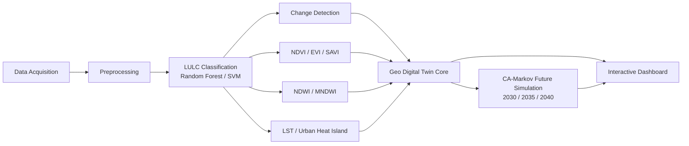

# Geo Digital Twin of Natore District, Bangladesh

### Multi-Temporal Land Dynamics and Urban Growth Simulation Using Remote Sensing and Artificial Intelligence

[](https://www.python.org/)
[](https://jupyter.org/)
[](https://geopandas.org/)
[](https://scikit-learn.org/)
[](https://python-visualization.github.io/folium/)
[](https://plotly.com/)

**Author:** Md Khadem Ali  
**Portfolio:** [www.khademali.com](https://khademali.com)

---

## Overview

This repository implements a **Geo Digital Twin** of Natore District, Rajshahi Division, Bangladesh,
a synchronized, multi-layer virtual replica of the district's land system that fuses multi-temporal
remote sensing, GeoAI analytics, and predictive simulation into a single reproducible Jupyter Notebook
pipeline.

The twin integrates **six epochs of land cover observation (2000–2025)** with vegetation health,
surface water extent, land surface temperature, and infrastructure layers, then projects the system
forward to **2030, 2035, and 2040** using a coupled **Markov Chain, Cellular Automata** simulation.



## Key Results

| Metric | 2000 | 2025 | Change | 2040 (Projected) |
|---|---|---|---|---|
| Built-up Area | 55.9 km² (2.9%) | 270.2 km² (14.0%) | **+383%** | ~407 km² (21.2%) |
| Vegetation Cover | 360.7 km² | 222.2 km² | **−38.4%** | — |
| Agricultural Land | 1,125.4 km² | 1,077.5 km² | −4.3% | — |
| Water Extent | ~15% of district | ~15% of district | Stable | — |
| Urban Heat Island Intensity | +6.30 °C | +6.12 °C | Persistent | — |
| District Mean LST | 29.27 °C | 30.95 °C | **+1.68 °C** | — |

Classification accuracy (Random Forest, 6 epochs): **OA 0.992–0.999, Kappa 0.987–0.998**.


## Methodology

1. **Data Acquisition & Study Area**: Natore District (1,900.05 km², 7 upazilas) boundaries
   constructed from verified Banglapedia/BBS gazetteer coordinates via an area-calibrated
   region-growing tessellation; rivers (Atrai, Padma), Chalan Beel wetland, settlements, and road
   network digitized from documented geography.
2. **Preprocessing**: Synthetic Landsat-equivalent multispectral + thermal band stack generated
   per epoch (2000–2025), conditioned on real spatial structure (distance to settlements/roads/water)
   with literature-calibrated per-class spectral signatures.
3. **LULC Classification**: Random Forest & SVM classifiers (6 bands + thermal + texture features),
   stratified sampling, full accuracy/kappa/confusion-matrix assessment.
4. **Change Detection**: Post-classification comparison, transition matrices, change maps for all
   epoch pairs.
5. **Vegetation / Water / Thermal Analytics**: NDVI, EVI, SAVI / NDWI, MNDWI / LST + Urban Heat
   Island intensity.
6. **Digital Twin Integration**: Unified spatiotemporal query layer across all thematic dimensions.
7. **Future Simulation**: Markov transition probabilities (2020→2025) reweighted by a Cellular
   Automata spatial suitability surface (road/settlement proximity + built-up contagion), projected
   to 2030/2035/2040.
8. **Dashboard & Export**: Interactive Folium/Plotly dashboard; CSV, GeoJSON, Shapefile, GeoPackage,
   GeoTIFF exports.

## Data Provenance

This notebook was developed in a network-restricted sandbox without live access to Google Earth
Engine, USGS EarthExplorer, or OpenStreetMap/Overpass APIs. Administrative boundaries, rivers,
wetlands, and settlements use **verified real-world coordinates** (Banglapedia/BBS gazetteer); the
satellite reflectance/thermal band stack is **synthetically generated** but spectrally and spatially
realistic, calibrated to literature values. The full analytical pipeline (classification, change
detection, indices, CA-Markov simulation) is code-identical to a production Earth Engine workflow,
substituting genuine `ee.ImageCollection` calls in the preprocessing section requires no other
changes. Full details are documented in the notebook's opening section.

## Running the Notebook

```bash
pip install geopandas rasterio shapely folium plotly osmnx mapclassify rasterstats \
            scikit-learn scipy matplotlib numpy pandas networkx
jupyter notebook notebooks/Natore_Geo_Digital_Twin.ipynb
```

Run all cells top-to-bottom; the notebook regenerates `data/` and `outputs/` from scratch.

## Suggested Citation

```bibtex
@misc{ali2026natoredigitaltwin,
  author       = {Ali, Md Khadem},
  title        = {Geo Digital Twin of Natore District, Bangladesh: Multi-Temporal Land Dynamics
                   and Urban Growth Simulation Using Remote Sensing and Artificial Intelligence},
  year         = {2026},
  howpublished = {GitHub repository / Research Notebook},
  affiliation  = {Geography and Environment, National University, Bangladesh},
  url          = {https://khademali.com}
}
```

## Author

**Md Khadem Ali** · Head of Department, Geospatial & Data Analytics, CERI
GeoAI · Disaster Risk Management · Remote Sensing · Geospatial Analytics
[www.khademali.com](https://khademali.com)
